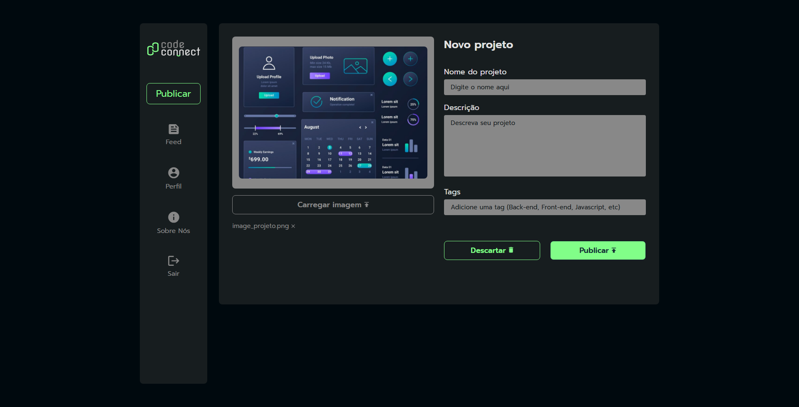

<h1>Code Connect</h1>

Mini rede social de publicação de projetos criada com o intuito de praticar minhas habilidades de JavaScript assíncrono, e praticar o pré-processador CSS SASS.



<h2>Como Acessar</h2>

A página pode ser acessada através deste [link](https://code-connect-t8xh.vercel.app/) 

ou realizando um clone deste repositório e acessando o index.html:
```
https://github.com/DFedizko/code-connect.git
```

<h2>Tecnologias Utilizadas</h2>
<div>
  
  
  
  
</div>

<h2>Sobre</h2>

Projeto criado com sass e funções assíncronas do javascript que é um tema que eu venho estudando bastante. Também foi utilizado timeouts para adicionar delay nas funções simulando requisições API e tratamento de erros com try e catch.

Importante ressaltar que apenas a página de publicar possui javascript, e as outras págians são completamente estáticas, pois meu objetivo era praticar bastante o pré processador SASS, e aprender mais sobre o javascript assíncrono. 
Claro que quanto ao visual das outras páginas elas não deixam nada a desejar, estão bem estruturadas e seguem um padrão de User Interface.

<h2>Desenvolvedor</h2>


| [<br><sub>Pedro Fedizko de Castro</sub>](https://github.com/DFedizko) |
| :---: |
