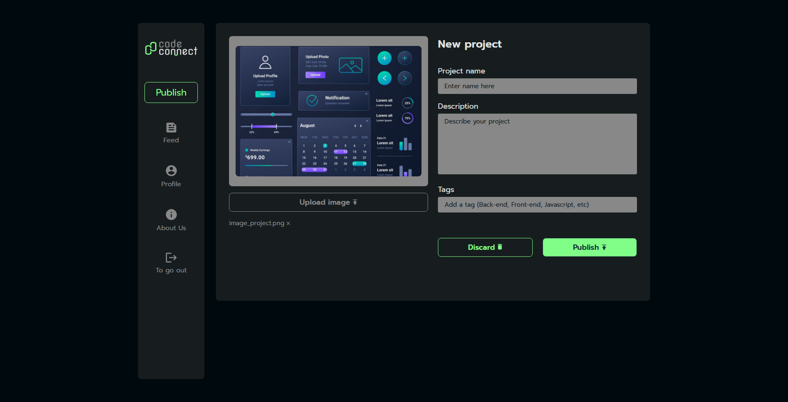

<h1>Code Connect</h1>

A mini social network for publishing projects, created to practice my JavaScript skills and SASS preprocessor.



<h2>How to Access</h2>

The page can be accessed via this [link](https://code-connect-t8xh.vercel.app/)

Or by cloning this repository and accessing the index.html:

```
https://github.com/DFedizko/code-connect.git
```

<h2>Technologies Used</h2>
<div>
  
  
  
  
</div>

<h2>About</h2>

This project was built using SASS and JavaScript asynchronous functions, a topic I’ve been focusing on lately. I also used timeouts to simulate API requests and error handling with try and catch.

It’s important to highlight that only the publishing page has JavaScript, while the other pages are completely static, as my goal was to practice the SASS preprocessor and deepen my understanding of asynchronous JavaScript.  
Of course, the design of the other pages is not lacking—they are well-structured and follow a User Interface standard.

<h2>Developer</h2>

| [<br><sub>Pedro Fedizko de Castro</sub>](https://github.com/DFedizko) |
| :---: |
